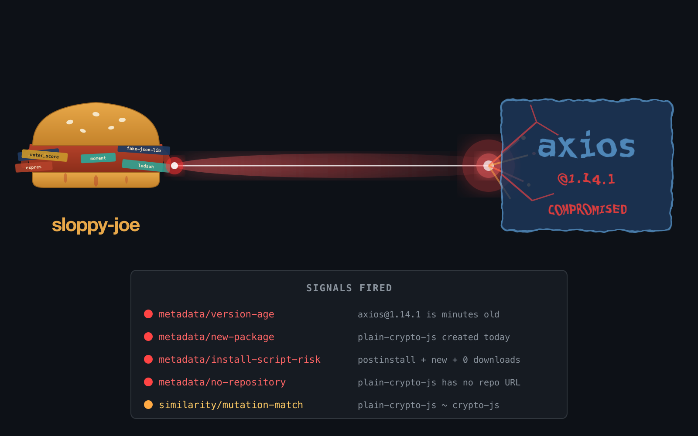

# How a sandwich defeats North Korea's hackers (and the US couldn't for 70 years)

**March 31, 2026**



Today, Google's Mandiant team [attributed the axios npm compromise](https://thehackernews.com/2026/03/axios-supply-chain-attack-pushes-cross.html) to UNC1069 — a North Korean threat group previously linked to cryptocurrency theft and attacks on DeFi platforms. The malicious code shares significant overlap with WAVESHAPER, a C++ backdoor Mandiant attributed to the same group in February.

North Korea just weaponized the most popular HTTP client in JavaScript. 100 million weekly downloads. The payload: a cross-platform RAT that harvests credentials, SSH keys, and cloud tokens from every developer machine that runs `npm install`.

The United States has spent 70 years and trillions of dollars trying to contain North Korea. Nuclear negotiations, sanctions, carrier groups, diplomatic pressure, UN resolutions. None of it has stopped the DPRK from becoming one of the most effective cyber threats on the planet.

**A sloppy joe sandwich stops them in 3 seconds.**

## What happened

On March 30, the attacker compromised the npm account of axios's lead maintainer (`jasonsaayman`) using a stolen access token. They changed the account email to a Proton Mail address and published two malicious versions:

- **axios@1.14.1** — published March 31, 00:21 UTC
- **axios@0.30.4** — published March 31, 01:00 UTC

Both versions injected a new dependency: `plain-crypto-js@4.2.1`. This package was never imported anywhere in the axios source. Its sole purpose was to run a `postinstall` hook that deployed platform-specific RATs:

- **macOS**: Binary at `/Library/Caches/com.apple.act.mond`, executed via AppleScript
- **Windows**: PowerShell RAT with Registry persistence and in-memory binary injection
- **Linux**: Python RAT script via `nohup`

The dropper script deleted itself after execution to hide forensic evidence. The attacker staged `plain-crypto-js` 18 hours in advance, pre-built three platform payloads, and hit both release branches within 39 minutes. This was not amateur hour.

## How sloppy-joe blocks every layer of this attack

sloppy-joe runs **before** `npm install`. It reads your `package-lock.json` and checks every dependency — direct and transitive — against multiple independent signals. No packages are downloaded. No code is executed.

### Signal 1: Version age gate

```
ERROR axios [metadata/version-age]
      Version '1.14.1' of 'axios' was published 0 hours ago (minimum: 72 hours).
      New versions need time for the community and security scanners to review them.
 Fix: Wait until the version is at least 72 hours old, or pin to an older version.
```

The compromised versions were live for 2-3 hours before npm yanked them. A 72-hour gate means they never get installed. Period. This requires zero knowledge of the attack — it works purely on the principle that new versions should survive community review before hitting production.

**This single check stops the attack.**

But sloppy-joe doesn't stop at one signal. With `--deep` transitive scanning, `plain-crypto-js` gets demolished by five independent checks:

### Signal 2: New package detection

```
ERROR plain-crypto-js [metadata/new-package]
      'plain-crypto-js' was first published 0 days ago. New packages are higher
      risk — verify this is a legitimate, maintained project before depending on it.
 Fix: Verify 'plain-crypto-js' at its registry page and source repository.
```

`plain-crypto-js` was created the day before the attack. Brand new packages as transitive dependencies of 100M-download packages are inherently suspicious.

### Signal 3: Install script risk amplifier

```
ERROR plain-crypto-js [metadata/install-script-risk]
      'plain-crypto-js' has install scripts AND was published 0 days ago and with
      0 downloads. Install scripts on new, low-download packages are the #1
      malware delivery vector.
 Fix: Do not install this package. Verify it is legitimate before proceeding.
```

Install scripts + new package + zero downloads. This is the exact fingerprint of a supply chain attack. sloppy-joe's install script risk signal combines multiple weak signals into a high-confidence detection. Every real-world npm supply chain attack in the last 5 years has matched this pattern.

### Signal 4: No source repository

```
WARNING plain-crypto-js [metadata/no-repository]
        'plain-crypto-js' has no source repository URL and is a new package
        (< 30 days old). Legitimate packages almost always link to their source code.
 Fix: Verify 'plain-crypto-js' at its registry page.
```

Legitimate packages link to their GitHub/GitLab repo. Malicious packages created as payload delivery vehicles don't bother.

### Signal 5: Name similarity

```
WARNING plain-crypto-js [similarity/mutation-match]
        'plain-crypto-js' is suspiciously similar to existing package 'crypto-js'
 Fix: Verify this is the package you intend to use.
```

`plain-crypto-js` is a clear attempt to look like `crypto-js` — a real, popular cryptography package with hundreds of millions of downloads. sloppy-joe's mutation generators catch this.

## Five signals. One sandwich. Zero dollars.

Here's what's remarkable: none of these detections require threat intelligence feeds, malware signature databases, or AI-powered behavioral analysis. They're all variations of the same primitive: **cross-reference what the code claims to use against what actually exists on the registry.**

- Is the version too new? Flag it.
- Is the transitive dep brand new? Flag it.
- Does a brand new package have install scripts? Block it.
- Does it have no source repository? Flag it.
- Does the name look like a popular package? Flag it.

Each signal alone is informational. All five firing together on the same package is a certainty.

## The cost of this defense

```bash
# Add to any CI pipeline
npx sloppy-joe check
```

That's it. One line. Runs in 5-15 seconds. No account needed. No API key. No subscription. Open source, MIT licensed.

The DPRK's UNC1069 spent 18 hours staging payloads, pre-building RATs for three platforms, and compromising a maintainer account. sloppy-joe catches it in the time it takes to read a `package-lock.json`.

## What sloppy-joe can't catch

Honesty matters: sloppy-joe would **not** have detected the credential theft itself. The attacker hijacked the real maintainer's account — the npm `_npmUser` field still shows `jasonsaayman`. There's no publisher change to detect. npm's [provenance attestation](https://docs.npmjs.com/generating-provenance-statements) (OIDC-based publishing via GitHub Actions) is the real defense against token theft — the malicious versions were published manually, bypassing axios's CI pipeline.

sloppy-joe catches the **payload**, not the **compromise**. But the payload is what hurts you.

## Get started

```bash
# Install
cargo install sloppy-joe

# Run
sloppy-joe check

# In CI (GitHub Actions)
- uses: brennhill/sloppy-joe-action@v1
```

**GitHub**: [github.com/brennhill/sloppy-joe](https://github.com/brennhill/sloppy-joe)

---

*sloppy-joe is an open-source supply chain security tool that catches hallucinated, typosquatted, and compromised dependencies before they reach production. It runs before your package manager, requires no code execution, and blocks attacks like axios, LiteLLM, event-stream, and ua-parser-js.*
